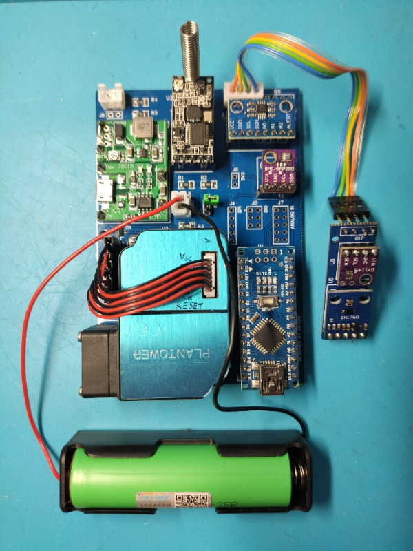

<p align="center">
  <a href="" rel="noopener">
 </a>
</p>

<h1 align="center">Weather Station Transmitter</h1>

<div align="center">

[]()
[](https://github.com/JakubJaszczur/433-Weather-Station-Transmitter/issues)
[](https://github.com/JakubJaszczur/433-Weather-Station-Transmitter/pulls)
[](/LICENSE)

</div>

---

<p align="center"> Weather Station based on HC12 transceiver
    <br> 
</p>

## Table of Contents

- [About](#about)
- [Features](#features)
- [Bill of Materials](#bill)
- [Libraries](#libraries)
- [Getting Started](#getting_started)
- [Description](#description)
- [Changelog](#changelog)
- [Task list](#task)
- [Pictures](#pictures)

## 1. About <a name = "about"></a>

Weather Station powered by 18650 Li-ion battery, charged by solar panel. 433MHz HC-12 module is used to send data formatted in JSON.

## 2. Features <a name = "features"></a>

* Various sensors - temperature, humidity, pressure, light intensity, UV index, PM2.5, PM10
* Battery and solar panel voltage measurements
* Possibility to add more sensors (e.g. by I2C)
* Deep sleep to save power
* Debug mode

## 3. Bill of Materials <a name = "bill"></a>

Main components:

| Device  		    | Description 	                          | Price		  | 
| --------------- | --------------------------------------- |-----------|
| Arduino Nano V3 | Main IC (clone)                         |	$2.50     |
| BME280          | Temperature, humidity, pressure sensor  |	$2.10     |
| MCP9808         | High accuracy temperature sensor        | $0.75     |
| BH1750          | Light sensor                            | $1.00     |
| SI1145          | UV index sensor                         | $3.70     |
| PMS3003         | Dust sensor                             | $13.40    |
| HC12            | 433MHz transceiver                      | $1.95     |
| J5019           | Battery charger with DC-DC converter    | $0.69     |
| 2000mAh Li-Ion  | 18650 Battery                           | $2.20     |
| 18650 holder    | 18650 Battery holder                    | $0.35     |
| PCB             | Custom PCB                              |           |
| Housing         | Custom housing (3D printed)             |           |
<br>
## 4. Libraries <a name = "libraries"></a>

- [ArduinoJson](https://github.com/bblanchon/ArduinoJson "ArduinoJsonD")
- [Adafruit MCP9808](https://github.com/adafruit/Adafruit_MCP9808_Library "Adafruit_MCP9808")
- [Adafruit BME280](https://github.com/adafruit/Adafruit_BME280_Library "Adafruit_BME280")
- [Adafruit Sensor](https://github.com/adafruit/Adafruit_Sensor "Adafruit_Sensor")
- [Adafruit SI1145](https://github.com/adafruit/Adafruit_SI1145_Library "Adafruit_SI1145")
- [BH1750 by Claws](https://github.com/claws/BH1750 "BH1750")
- [PMserial by Alvaro Valdebenito](https://github.com/avaldebe/PMserial "PMserial")

## 5. Getting Started <a name = "getting_started"></a>

To run Weather Station, user should change some settings:

Node ID - used to identify device by receiver 
```
#define NODE_ID           103   // Device ID, for internal purpose
```
Sleep time - how often device will wake up and send measurements 
```
#define SLEEP_TIME        37    // x * 8s = sleep time
```
Calibration factors - booth should be 1.0 at the beginning, later can be adjusted to fit measured voltages to real values
```
#define BAT_FACTOR        0.979981    // a = y/x, calibration factor
#define PAN_FACTOR        0.986017    // a = y/x, calibration factor
```
Altitude - set real value of your location, used for pressure readings
```
#define ALTITUDE        515.0 //define altitude of location
```

## 6. Description <a name = "description"></a>

#### Measurements
- <b>Temperature:</b> measured by MCP9808 to ensure high accuracy (0,25&ordm;C)
- <b>Humidity, Pressure:</b> measured by BME280
- <b>Light:</b> measured by BH1750 (lux)
- <b>UV index:</b> measured by SI1145
- <b>PM2.5, PM10:</b> measured by PMS3003 
- <b>Voltages:</b> battery and solar panel voltages measured by analog inputs

#### Output Parameters

Measurements send by device using HC-12:

```json
{
  "id":103,
  "te":4,       // temperature
  "hu":72,      // humidity
  "pr":1024.8,  // pressure
  "p2":34,      // PM2.5
  "p1":45,      // PM10
  "ba":4.07,    // battery voltage
  "pa":4.794    // solar panel voltage
}
```

## 7. Changelog <a name="changelog"></a>

2021-04-09 <b>V1.0</b> Stable version  

## 8. Task list <a name="task"></a>

- Software:
- [] Service commands (receive data, e.g. calibration factors, sleep time and store in EEPROM)

- Hardware:
- [] Add additional capacitor to Vcc for better stability
- [] Change MOSFET circuit - Q1 should be connected to GND, add gate-source resistor 
- [] For future - add anemometer, rainmeter, wid direction etc.

## 9. Pictures <a name="pictures"></a>



